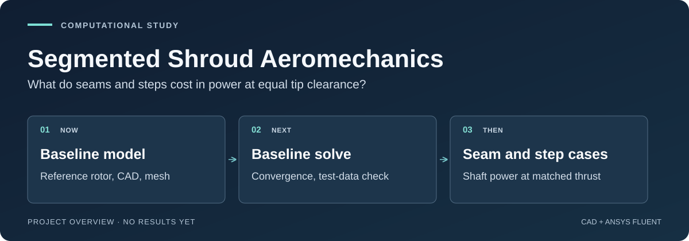

# Segmented Shroud Aeromechanics

A shroud around a drone rotor can add thrust, but only if it stays close to the
blade tips all the way round. A shroud built in segments has seams and small
steps where the pieces meet. This project uses CAD and ANSYS Fluent to find out
how much those seams and steps cost in power, compared with a smooth shroud with
the same average tip gap.

[](https://github.com/500ft/segmented-shroud-aeromechanics/actions/workflows/ci.yml)

[](LICENSE)

[The question](#the-question) · [Where it stands](#where-it-stands) ·
[Roadmap](ROADMAP.md) · [Quick start](#quick-start) · [Reviewer guide](docs/START_HERE.md)



*Project overview diagram of the three remaining steps. There are no results yet.*

## The question

Tip clearance matters for any ducted rotor, and that is well known. The
narrower question here is whether the shape of the defects adds information
beyond the average gap: two shrouds with the same mean clearance, one smooth and
one with seams or steps, compared at the same total thrust. The main output is
the shaft power each needs.

The study uses rigid geometry only, so deployment mechanisms stay out of the
model. The [source review](docs/day3-source-review.md) explains how prior work
narrowed the question to this equal-mean-clearance comparison.

## Where it stands

The owner chose a computational finish on 2026-09-29: CAD, Fluent runs,
convergence and sensitivity checks, and a report. A thrust stand is no longer
needed to finish ([decision](docs/decision-log.md#2026-09-29--finish-as-a-cadansys-computational-study)).

- Fluent Student 2026 R1 starts on the CAD host and checks out its licence
  ([readiness record](evidence/task-cad-ansys-2026-09-29/README.md)). No case
  has been solved.
- That licence caps a model at 1,000,000 cells and 4 cores. Resolving the tip
  gap on a full rotor in a seamed duct probably won't fit, so the baseline mesh
  study decides how the rotor is modelled. The [roadmap](ROADMAP.md) explains
  the options.
- An earlier OpenFOAM check on a 2D NACA 0012 airfoil matches published
  reference computations within 0.4%. Its full validation uncertainty is
  incomplete ([A0.1 report](docs/cfd-validation-a01.md)).
- The analysis pipeline for the final comparison is written and tested on
  synthetic data.

No shroud geometry, mesh or flow solution exists yet.

## Quick start

Python 3.11 (the CI version) and Git. The only dependency is pinned in
[requirements.txt](requirements.txt). No CAD licence, solver or hardware is
needed.

```bash
git clone https://github.com/500ft/segmented-shroud-aeromechanics.git
cd segmented-shroud-aeromechanics
python3.11 -m venv .venv
source .venv/bin/activate
python -m pip install -r requirements.txt
python scripts/check_repo_contract.py
python scripts/acquisition_ledger.py --check
python scripts/reference_coverage.py --check
python scripts/clearance_uncertainty_budget.py --check
python -m unittest discover -s tests -v
```

On Windows, activate with `.venv\Scripts\Activate.ps1` instead of `source`.

The contract check and the three record checks should pass (the measurement
budget reports `INPUTS_PENDING`), and the tests should end with `OK`.

To rebuild the literature ledger from committed inputs (offline; unchanged
inputs give no diff):

```bash
python scripts/acquisition_ledger.py
git diff -- evidence/task-day3-2026-09-09/acquisition-ledger.json
```

## What's next

The first step is the owner's: choose the reference rotor. The roadmap
recommends the Akturk–Camci 8-blade ducted fan, which was tested with a duct
at several tip clearances, over the unducted Caradonna–Tung rotor. After that
come the reference geometry, the baseline mesh and its cost, the baseline
solve, and the seam and step cases.

## Limits

- Everything so far is software, literature and planning. No shroud CFD has run.
  No shroud specimen, aerodynamic measurement, or rubbing test has been completed for this repository.
- The study compares predicted shaft power. Electrical efficiency, rubbing risk
  and deployment reliability are outside it.
- A good aerodynamic result would say nothing about whether the shroud protects
  against impacts; that needs its own tests.
- Rotor testing, if it ever happens, needs containment, remote arming and
  shutdown, current protection, a risk assessment and facility approval.
- Mechanism details are withheld under the
  [public-disclosure boundary](CONTRIBUTING.md#public-disclosure-boundary).

## Documentation

| Document | What it covers |
| --- | --- |
| [Reviewer guide](docs/START_HERE.md) | The project in five minutes |
| [Roadmap](ROADMAP.md) | Finish line, the licence constraint, remaining steps |
| [Decision log](docs/decision-log.md) | Scope decisions and their reasons |
| [Source review](docs/day3-source-review.md) · [prior art](docs/prior-art.md) | Closest competing work |
| [Literature](docs/literature/README.md) | Every source identified, and which were actually read |
| [Research plan](docs/research-plan.md) · [claim ledger](docs/claim-ledger.md) | Variables and claims |
| [Experiment 01](docs/experiment-01-rigid-defect-duct.md) | The deferred physical experiment |

## Contributing and license

Reproduction reports, source corrections and CFD or metrology critiques are
welcome. Include the commit, the command or source location, and what you
expected and saw. Read [CONTRIBUTING.md](CONTRIBUTING.md) before opening a
[pull request or issue](https://github.com/500ft/segmented-shroud-aeromechanics/issues).

Software is [MIT licensed](LICENSE); publications keep their own licenses.
This is a research repository, not a qualified rotor enclosure or fabrication
package. [Repository identity](docs/REPOSITORY_IDENTITY.md).
